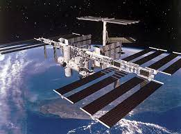
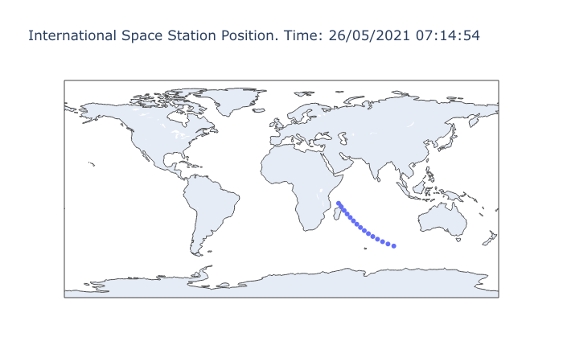

### READ ME

# International Space Station position tracker

Python code to display the International Space Station (ISS) position.

Code uses open-notify.org API for ISS position Latitude and Longitude data.

The position information is then ploted using Plotly GEO scatter chart

Currently set to poll the data every 60 seconds over 15 minutes.

The ISS is moving roughly an altude of 400 kilometers above the Earth's surface. It circles the globe at 28,000 km/h, which means it orbits the Earth every 90 minutes. To plot the entire orbit, increase the polling range to 90.

Plots are shown in the graphs window of the Integrated Development Environment.

Possible future updates:
1> Ask for user input for total polling and polling interval.

2> Save plot to disc for saving.

3> Save polling data to disc for possible interval polling over several periods.

4> Add any other possible tracking data to the chart

Christopher Phillips 2021